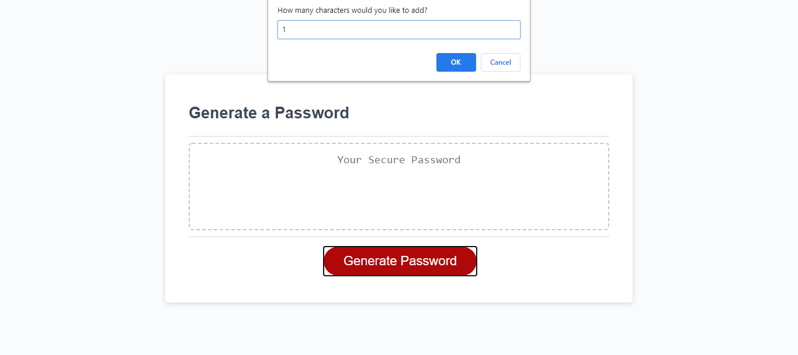
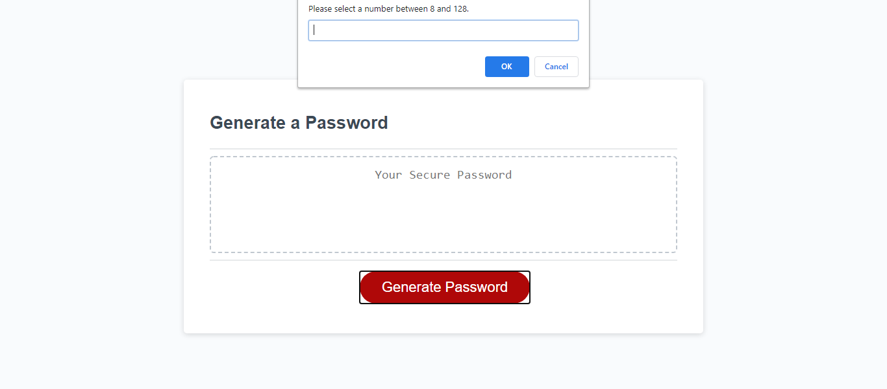

# Week-4-Password-Generator

### Description
In this project, I have created a random password generator using JavaScript. The user will be prompted to fill in how long they would like their password to be. They then decide whether they want uppercase, lowercase, numbers and symbols in their password and the generator generates a secure password for them. I was inspired to do this project because I wanted to learn more about the functions and syntax of JavaScript. Hope you enjoy!

---

### Table of Contents
* [Installation](#Installation) 
* [Usage](#Usage)  
* [Credits](#Credits)  
* [Badges](#Badges)  
* [License](#License)

---

### Installation 
<a href = "https://mbennett1991.github.io/Week-4-Password-Generator/Homework/">Click me</a> to generate your own password!

---

### Usage  
To further show the interactive-ness of the password generator I have included screenshots of what happens when you do not put in a suitable number for the length of said password. 

---

### Links
Below is a link to my gitHub pages to see more of my work!

<a href = "https://mbennett1991.github.io/">Click me</a>
 
---
  
### Credits
@ChiggyO

---

### Badges 

---

### License 
© 2020 Trilogy Education Services, a 2U, Inc. brand. All Rights Reserved.